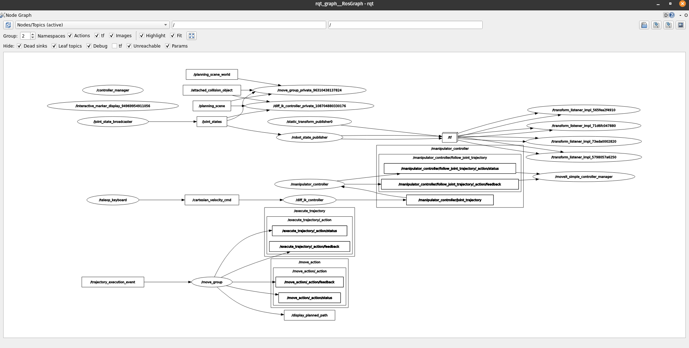

# ROS 2 & MoveIt 2 Motion Planning Architecture Report

## 1. System Architecture & Dataflow
The motion planning system is built on a decentralized ROS 2 architecture, utilizing MoveIt 2 for spatial awareness and `ros2_control` for hardware actuation. 

Please refer to the attached reference file **image_26a103.png** for the visual `rqt_graph` layout of the active system. 

The primary control dataflow operates as follows:
*   User inputs are captured and translated into instantaneous Cartesian velocity targets (`/cartesian_velocity_cmd`).
*   The differential kinematics solver processes these targets alongside real-time hardware feedback (`/joint_states`).
*   The solver streams continuous joint trajectories to the hardware interface (`/manipulator_controller/joint_trajectory`).
*   The `robot_state_publisher` continuously distributes the updated TF tree (Transforms) to RViz and the planning scene based on the current joint positions.

## 2. Node & Component Documentation

### `/teleop_keyboard`
*   **Role:** Real-time user input translation.
*   **Function:** Captures keyboard keystrokes and maps them to 3D spatial vectors. 
*   **Output:** Publishes a continuous stream of `geometry_msgs/msg/Twist` messages to the `/cartesian_velocity_cmd` topic.

### `/diff_ik_controller`
*   **Role:** Resolved-rate motion control mapping Cartesian velocities to joint velocities.
*   **Function:** OMPL-based global planning (MoveIt) is too slow for real-time teleoperation. This node bypasses the global planner, reading the live `/joint_states` to compute the manipulator's current Jacobian matrix. It uses a Damped Least Squares (DLS) pseudo-inverse algorithm to prevent velocity spikes near singularities:
    q_dot = J^T (J J^T + λ^2 I)^-1 x_dot
*   **Output:** Streams short-horizon `trajectory_msgs/msg/JointTrajectory` messages to the controller manager to achieve smooth, low-latency motion.

### `/move_group`
*   **Role:** The core MoveIt 2 motion planning and collision checking engine.
*   **Function:** Maintains the `/monitored_planning_scene`, accounting for static and dynamic obstacles (e.g., the ground plane). It ensures that all requested joint configurations remain strictly within the physical and self-collision limits defined by the URDF/SRDF.

### `/controller_manager` & `/manipulator_controller`
*   **Role:** The bridge between software commands and physical hardware.
*   **Function:** Absorbs the trajectory commands from the IK solver, interpolates them, and drives the simulated or physical joint motors via the `JointTrajectoryControllerState` interface.

## 3. Issues Encountered & Key Learnings

### Issue 1: The "Silent Death" of Fake Hardware
*   **Problem:** The C++ planner node would boot and connect to MoveIt, but planning requests would stall indefinitely without throwing a direct error. 
*   **Root Cause:** The `use_fake_hardware:=true` flag and the corresponding `<ros2_control>` tags were missing from the URDF. The controller manager assumed physical USB/Ethernet motors were attached and waited for them to boot. This resulted in a completely dead `/joint_states` topic, leaving MoveIt blind to the robot's starting position.
*   **Resolution:** Injected the `mock_components/GenericSystem` plugin into the URDF hardware interface to simulate motor feedback.

### Issue 2: Migrating from Python to C++ (MoveIt 2 API)
*   **Problem:** Attempted to implement the Stage 1 planning requirements (Model loading, FK, IK, execution) using the `moveit_py` Python API. The standard `apt` package manager failed to locate the necessary libraries on a clean Ubuntu installation.
*   **Root Cause:** Python bindings for MoveIt 2 in ROS 2 Humble are highly experimental and omitted from default distribution mirrors. Relying on them required injecting custom web repositories and compiling core libraries from source.
*   **Resolution:** Pivoted the architecture entirely to C++ using `MoveGroupInterface` and `PlanningSceneInterface`. This guaranteed stability and ensured the repository remained reproducible and capable of being cleanly cloned and built on any standard ROS 2 Humble machine.

### Issue 3: C++ Node Execution Deadlocks
*   **Problem:** The C++ node failed to read joint states while executing planning commands.
*   **Root Cause:** The ROS 2 single-threaded executor was blocking the node's background communication while waiting for MoveIt planning functions to return.
*   **Resolution:** Implemented `rclcpp::executors::MultiThreadedExecutor` and spun the node in a detached `std::thread`, allowing simultaneous execution of terminal callbacks and hardware state monitoring.